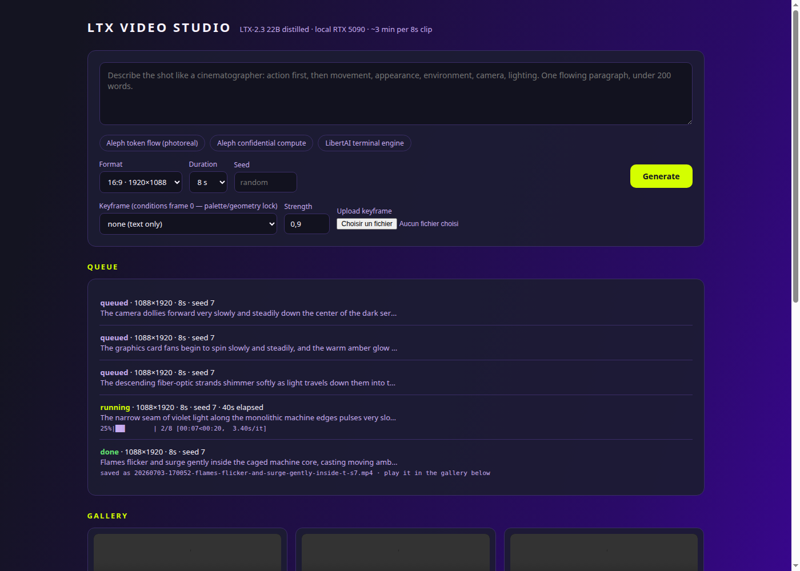

# LTX Video Studio (local)

Minimal self-hosted web UI for generating videos with [LTX-2.3](https://github.com/Lightricks/LTX-2)
(22B, open weights) on your own GPU. Single-page UI, serial job queue, gallery,
and first-frame **keyframe conditioning** for art-directed results.

Tested on an RTX 5090 (32 GB) with the CPU-offload recipe: ~3 min per 8 s
1080p clip, ~6 min for 15 s, native synced audio.



## Setup

1. Clone and set up the LTX-2 repo (needs [uv](https://docs.astral.sh/uv/)):

```bash
git clone https://github.com/Lightricks/LTX-2.git ~/repos/LTX-2
cd ~/repos/LTX-2
uv sync --frozen --extra xformers
```

2. Download the models (~67 GB total; Gemma is gated, accept its license on HF first):

```bash
uvx --from 'huggingface_hub[cli]' hf download Lightricks/LTX-2.3 \
  ltx-2.3-22b-distilled-1.1.safetensors ltx-2.3-spatial-upscaler-x2-1.1.safetensors
uvx --from 'huggingface_hub[cli]' hf download google/gemma-3-12b-it-qat-q4_0-unquantized
```

3. Set up and run this app:

```bash
git clone https://github.com/moshemalawach/ltx-webui.git
cd ltx-webui
uv venv && uv pip install fastapi 'uvicorn[standard]' python-multipart
.venv/bin/uvicorn app:app --host 127.0.0.1 --port 7860
```

Open http://127.0.0.1:7860/

## Configuration

Model files are auto-discovered in `~/.cache/huggingface/hub`. Override with
env vars if needed:

| Variable | Meaning | Default |
|---|---|---|
| `LTX_REPO_DIR` | cloned LTX-2 repo (with its `.venv`) | `~/repos/LTX-2` |
| `LTX_CHECKPOINT` | distilled checkpoint `.safetensors` | auto-discovered |
| `LTX_UPSAMPLER` | spatial upscaler `.safetensors` | auto-discovered |
| `LTX_GEMMA_ROOT` | Gemma 3 text encoder directory | auto-discovered |

## Usage notes

- **Keyframe conditioning is the quality lever.** Text-only prompts gamble on
  the seed; conditioning frame 0 on a curated still (from any image model)
  locks palette and geometry, and the prompt then only needs to describe
  motion and audio. Upload keyframes in the UI (png/jpg/webp, match your
  target aspect ratio).
- Prompting: single flowing paragraph, cinematographer language, describe the
  audio explicitly, avoid numerical constraints and in-frame text. See the
  [LTX-2.3 prompt guide](https://ltx.io/blog/ltx-2-3-prompt-guide).
- Dimensions must be divisible by 64; frame count is `8k+1` (the UI presets
  handle this). Capped at 1920x1088 and 377 frames.
- Jobs run one at a time (single GPU). The model reloads each job (~40 s).
- The job list is in-memory (cleared on restart); the gallery rebuilds from
  `outputs/`.

## Security

Binds to 127.0.0.1 with **no auth**. Do not expose the port. The generation
subprocess runs whatever paths the env vars point at — treat the config as
trusted input.

## License

MIT for this UI. LTX-2.3 weights are under the
[LTX-2 Community License](https://huggingface.co/Lightricks/LTX-2.3/blob/main/LICENSE)
(free under $10M revenue; check before commercial use at scale). Gemma is
under its own license.
