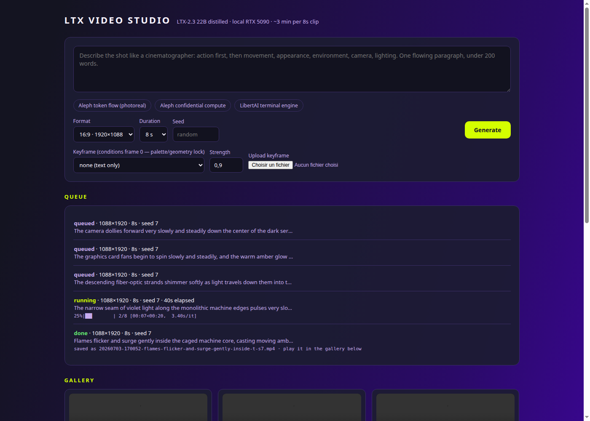

# UGC Factory (local)

Self-hosted UGC production workspace powered by [LTX-2.3](https://github.com/Lightricks/LTX-2)
(22B, open weights) on your own GPU. It includes structured creative briefs,
LibertAI/GLM-5.2 co-writing, batch prompt refinement, a serial render queue,
a gallery, and first-frame **keyframe conditioning** for art-directed results.

Tested on an RTX 5090 (32 GB) with the CPU-offload recipe: ~3 min per 8 s
1080p clip, ~6 min for 15 s, native synced audio.



## Setup

1. Clone and set up the LTX-2 repo (needs [uv](https://docs.astral.sh/uv/)):

```bash
git clone https://github.com/Lightricks/LTX-2.git ~/repos/LTX-2
cd ~/repos/LTX-2
uv sync --frozen --extra xformers
```

2. Download the models (~67 GB total; Gemma is gated, accept its license on HF first):

```bash
uvx --from 'huggingface_hub[cli]' hf download Lightricks/LTX-2.3 \
  ltx-2.3-22b-distilled-1.1.safetensors ltx-2.3-spatial-upscaler-x2-1.1.safetensors
uvx --from 'huggingface_hub[cli]' hf download google/gemma-3-12b-it-qat-q4_0-unquantized
```

3. Set up and run this app:

```bash
git clone https://github.com/moshemalawach/ltx-webui.git
cd ltx-webui
uv venv && uv pip install fastapi 'uvicorn[standard]' python-multipart
.venv/bin/uvicorn app:app --host 127.0.0.1 --port 7860
```

Open http://127.0.0.1:7860/

Video previews use capped byte-range responses so long MP4 transfers cannot
monopolize all HTTP/1.1 browser connections to the local API.

## Configuration

Model files are auto-discovered in `~/.cache/huggingface/hub`. Override with
env vars if needed:

| Variable | Meaning | Default |
|---|---|---|
| `LTX_REPO_DIR` | cloned LTX-2 repo (with its `.venv`) | `~/repos/LTX-2` |
| `LTX_CHECKPOINT` | distilled checkpoint `.safetensors` | auto-discovered |
| `LTX_UPSAMPLER` | spatial upscaler `.safetensors` | auto-discovered |
| `LTX_GEMMA_ROOT` | Gemma 3 text encoder directory | auto-discovered |
| `LIBERTAI_API_KEY` | server-side key for the GLM co-writer | unset |
| `LIBERTAI_MODEL` | LibertAI text model ID | `glm-5.2` |
| `LIBERTAI_BASE_URL` | OpenAI-compatible API root | `https://api.libertai.io/v1` |
| `LIBERTAI_TIMEOUT` | co-writer timeout in seconds | `120` |
| `LTX_PREVIEW_CHUNK_BYTES` | maximum preview range response size | `1048576` |

Enable the co-writer with a key from the
[LibertAI developer console](https://console.libertai.io/). The app automatically
loads an ignored `.env` file from the repository root:

```bash
printf 'LIBERTAI_API_KEY=%s\n' 'your-key' > .env
.venv/bin/uvicorn app:app --host 127.0.0.1 --port 7860
```

The key stays in the server process and is never returned to the browser.

## Usage notes

- **Keyframe conditioning is the quality lever.** Text-only prompts gamble on
  the seed; conditioning frame 0 on a curated still (from any image model)
  locks palette and geometry, and the prompt then only needs to describe
  motion and audio. Upload keyframes in the UI (png/jpg/webp, match your
  target aspect ratio).
- Prompting: single flowing paragraph, cinematographer language, describe the
  audio explicitly, avoid numerical constraints and in-frame text. See the
  [LTX-2.3 prompt guide](https://ltx.io/blog/ltx-2-3-prompt-guide).
- Manual variant prompts are saved locally and protected from automatic brief
  synchronization. **Render variant N** queues only the selected prompt and
  reuses its last assigned seed; **Reset selected** is the explicit way to
  discard that prompt's edits.
- Spoken copy uses a conservative duration budget and reserves the final 0.75 s
  for a natural hold. The UI and API reject quoted dialogue that exceeds the
  selected clip's limit instead of sending an overloaded prompt to LTX.
- Dimensions must be divisible by 64; frame count is `8k+1` (the UI presets
  handle this). Capped at 1920x1088 and `LTX_MAX_FRAMES` frames, default 505.
- For longer narrative segments on the same VRAM budget, use more frames at a
  lower frame rate, e.g. 249 frames at 16 fps for about 15.5 seconds. Larger
  frame counts may work when more VRAM is free.
- Jobs run one at a time (single GPU). The model reloads each job (~40 s).
- The job list is in-memory (cleared on restart); the gallery rebuilds from
  `outputs/`.

## Security

The app has **no auth**. Keep the default localhost binding unless LAN access
is intentional. Any client that can reach the app can enqueue GPU jobs and,
when configured, invoke the paid LibertAI co-writer. The generation subprocess
runs whatever paths the env vars point at, so treat the config as trusted input.

## License

MIT for this UI. LTX-2.3 weights are under the
[LTX-2 Community License](https://huggingface.co/Lightricks/LTX-2.3/blob/main/LICENSE)
(free under $10M revenue; check before commercial use at scale). Gemma is
under its own license.

## Post-production example (overlays/)

`overlays/` contains the working example of the full brand-film layer used to
produce vertical films from generated shots:

- `make_overlays.py` / `make_overlays_v2.py` — SVG-templated type plates,
  scrims, and cold-open cards rendered to PNG (Inkscape).
- `make_lockups.py` — full-bleed end cards.
- `build_films.sh` / `build_films_v2.sh` — ffmpeg assembly: cold open, graded
  shots, sliding type, textless inserts, audio bed, lockup. Paths overridable
  via `LTX_OUTPUTS` / `LTX_OVERLAYS`.

The copy/branding in the configs is example content — swap in your own.

The sovereign-AI story cut runner is `overlays/build_sovereign_ai_story_long.py`.
It queues long scenes, extracts each scene's tail frame as continuity input for
the next scene, then assembles a no-text film with a continuous soundtrack.

## Production workflow reboot

For higher-quality narrative work, start with the researched shot workflow
instead of the distilled-only web queue:

- `docs/ltx-video-production-research.md` — source-backed production method,
  pipeline choice, long-video continuity strategy, and QC rules.
- `docs/sovereign-ai-reboot-treatment.md` — rebooted sovereign-AI scenario,
  visual bible, reference still list, and shot prompts.
- `overlays/sovereign_ai_reboot_lab.py` — reproducible HQ two-stage commands,
  low-res probes, ffprobe audit, and contact-sheet generation.

Example:

```bash
python3 overlays/sovereign_ai_reboot_lab.py render-probe
python3 overlays/sovereign_ai_reboot_lab.py dry-run
python3 overlays/sovereign_ai_reboot_lab.py render-shot s01-dependency
```
